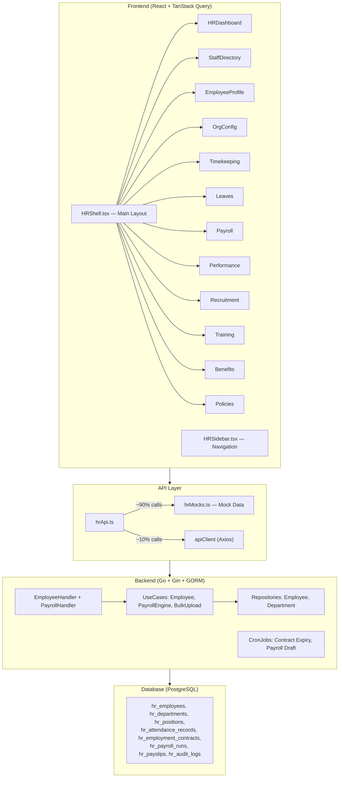
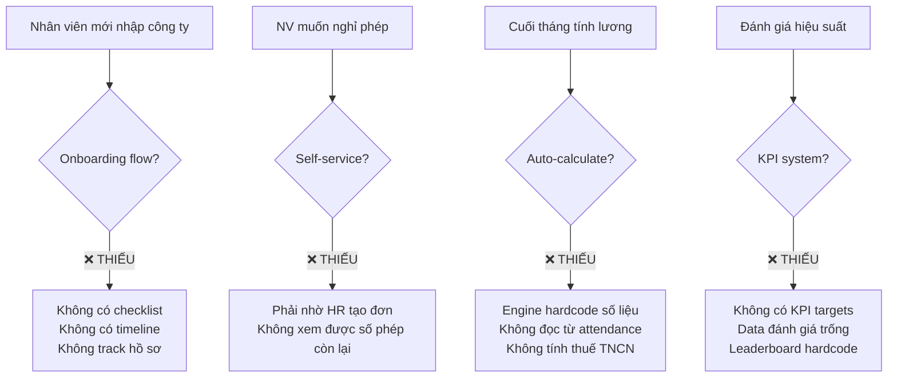
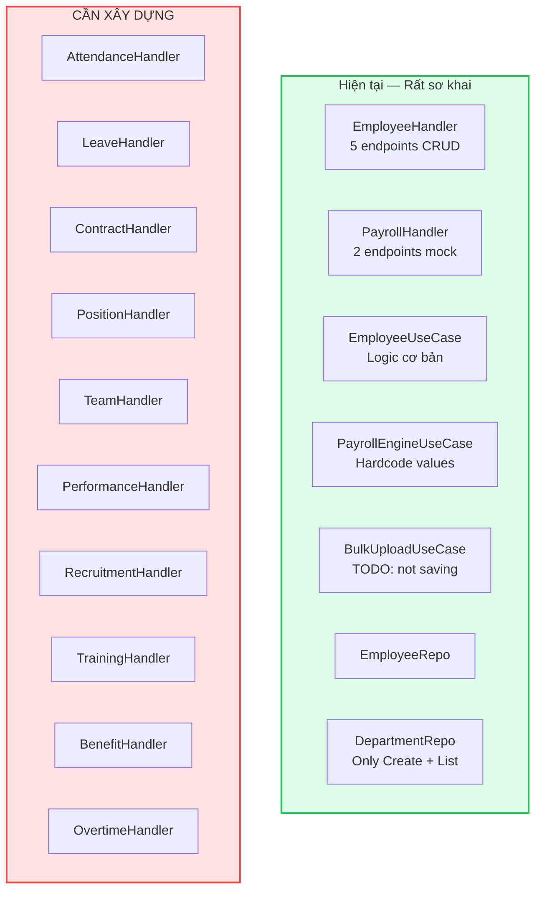

# 🏢 PHÂN TÍCH & ĐỀ XUẤT NÂNG CẤP MODULE NHÂN SỰ (HRM)
## SGROUP ERP – Đánh giá Toàn diện

> **Ngày phân tích**: 13/04/2026  
> **Phạm vi**: BA · UI · UX · Frontend · Backend · Database  
> **Trạng thái hiện tại**: Module đang ở giai đoạn MVP — phần lớn dữ liệu dùng Mock Data, backend Go chỉ xây dựng được CRUD cơ bản cho Employee.

---

## MỤC LỤC
1. [Tổng quan Kiến trúc Hiện tại](#1-tổng-quan-kiến-trúc-hiện-tại)
2. [Phân tích BA – Nghiệp vụ](#2-phân-tích-ba--nghiệp-vụ)
3. [Phân tích UI – Giao diện](#3-phân-tích-ui--giao-diện)
4. [Phân tích UX – Trải nghiệm](#4-phân-tích-ux--trải-nghiệm)
5. [Phân tích Frontend](#5-phân-tích-frontend)
6. [Phân tích Backend](#6-phân-tích-backend)
7. [Phân tích Database](#7-phân-tích-database)
8. [Ma trận Đánh giá Tổng hợp](#8-ma-trận-đánh-giá-tổng-hợp)
9. [Lộ trình Nâng cấp Đề xuất](#9-lộ-trình-nâng-cấp-đề-xuất)

---

## 1. TỔNG QUAN KIẾN TRÚC HIỆN TẠI

### 1.1 Sơ đồ Module



### 1.2 Thống kê Codebase

| Layer | Files | Tổng Lines | Ghi chú |
|-------|-------|-----------|---------|
| **Screens** | 12 files | ~3,200 LOC | Đầy đủ UI cho 12 chức năng |
| **Components** | 5 files | ~700 LOC | Chỉ có components cho Directory |
| **Hooks** | 2 files | ~590 LOC | 50+ hooks (React Query) |
| **API** | 2 files | ~375 LOC | 90%+ dùng Mock Data |
| **Types** | 1 file | 71 LOC | Chỉ 6 interfaces cơ bản |
| **Backend Handlers** | 2 files | ~180 LOC | Chỉ Employee CRUD + Payroll mock |
| **Backend UseCases** | 3 files | ~195 LOC | Logic rất sơ khai |
| **Backend Repos** | 2 files | ~100 LOC | Chỉ Employee + Department |
| **Domain Models** | 6 files | ~215 LOC | 7 entities |

---

## 2. PHÂN TÍCH BA – NGHIỆP VỤ

### 2.1 Điểm mạnh ✅

| # | Tính năng | Mô tả |
|---|-----------|-------|
| 1 | **Phủ rộng chức năng** | Đã thiết kế 12 màn hình bao quát: Dashboard, Danh bạ, Hồ sơ, Cơ cấu tổ chức, Chấm công, Nghỉ phép, Lương, Hiệu suất, Tuyển dụng, Đào tạo, Phúc lợi, Chính sách |
| 2 | **Sơ đồ tổ chức** | Hỗ trợ cấu trúc: Department → Team → Employee → Manager |
| 3 | **Workflow phê duyệt** | LeavesScreen đã có thiết kế 3 bước duyệt (Leader → Manager → HR Director) |
| 4 | **AI Copilot placeholder** | HRShell tích hợp sẵn HR Copilot chatbot interface |
| 5 | **ATS (Applicant Tracking)** | Recruitment có Kanban pipeline: NEW → INTERVIEW → OFFERED → REJECTED |

### 2.2 Điểm yếu & Gaps nghiêm trọng 🔴

| # | Gap | Mức độ | Chi tiết |
|---|-----|--------|----------|
| 1 | **Không có quy trình Onboarding/Offboarding** | 🔴 Critical | Không có checklist tiếp nhận nhân viên mới (hồ sơ, thiết bị, tài khoản, đào tạo hội nhập) |
| 2 | **Thiếu quản lý Hợp đồng lao động** | 🔴 Critical | Backend có `EmploymentContract` model nhưng frontend không có UI quản lý hợp đồng, gia hạn, theo dõi sắp hết hạn |
| 3 | **Không có hệ thống thưởng/phạt** | 🟡 High | Payroll hardcode allowances = 500,000₫, không có bảng khen thưởng, kỷ luật |
| 4 | **Thiếu quản lý Tài sản giao cho NV** | 🟡 High | Laptop, thẻ, badge, chìa khóa — không có module nào quản lý |
| 5 | **Không có Self-Service Portal** | 🟡 High | Nhân viên không thể tự xem phiếu lương, tự nộp đơn nghỉ, tự cập nhật hồ sơ |
| 6 | **Thiếu tích hợp liên module** | 🟡 High | HR không kết nối với Sales (commission), Project (resource allocation), Finance (cost center) |
| 7 | **Không có Org Chart trực quan** | 🟢 Medium | OrgConfigScreen chỉ là bảng CRUD, không có cây tổ chức kéo thả |
| 8 | **Đào tạo rất sơ khai** | 🟢 Medium | Training chỉ có CRUD course, không có LMS, tracking progress, chứng chỉ |
| 9 | **Không có luật lao động VN** | 🔴 Critical | Phép năm theo thâm niên, BHXH/BHYT/BHTN, thuế TNCN — đều chưa có |

### 2.3 Đề xuất Nghiệp vụ Mới

```mermaid
graph LR
    subgraph Phase1["Phase 1 — Foundation"]
        A1["Onboarding Workflow"]
        A2["Contract Management"]
        A3["VN Labor Law Engine"]
        A4["Employee Self-Service"]
    end
    
    subgraph Phase2["Phase 2 — Operations"]
        B1["Asset Management"]
        B2["Reward & Discipline"]
        B3["OKR/KPI Framework"]
        B4["LMS Training"]
    end

    subgraph Phase3["Phase 3 — Intelligence"]
        C1["HR Analytics Dashboard"]
        C2["Turnover Prediction AI"]
        C3["Smart Scheduling AI"]
        C4["Cross-module Sync"]
    end

    Phase1 --> Phase2 --> Phase3
```



---

## 3. PHÂN TÍCH UI – GIAO DIỆN

### 3.1 Điểm mạnh ✅

| # | Aspect | Đánh giá |
|---|--------|----------|
| 1 | **Design System nhất quán** | Sử dụng hệ thống `sg-*` tokens (sg-red, sg-card, sg-border, sg-heading...) xuyên suốt |
| 2 | **Dark Mode** | Hỗ trợ đầy đủ light/dark với toggle button |
| 3 | **Glassmorphism effects** | Aurora backdrop, blur, transparency tạo cảm giác premium |
| 4 | **Component library** | SGStatsCard, SGGlassPanel — reusable base components |
| 5 | **Responsive hints** | Sử dụng grid cols responsive (1 → 2 → 4) |
| 6 | **Data visualization** | Timekeeping heatmap, Payroll bar chart, Performance progress bars |
| 7 | **Gamification** | Performance có Leaderboard "Bảng Vàng Thành Tích" |

### 3.2 Điểm yếu 🔴

| # | Vấn đề | Chi tiết | Đề xuất |
|---|--------|----------|---------|
| 1 | **Không có Avatar/Photos** | Tất cả đều dùng text initials (chữ cái đầu tên) | Thêm upload ảnh đại diện, hiển thị real avatar |
| 2 | **Biểu đồ sử dụng CSS thuần** | Payroll bar chart, heatmap đều render bằng div | Tích hợp Recharts/Chart.js cho interactive charts |
| 3 | **Heatmap dùng Math.random()** | Timekeeping heatmap data là random mỗi lần render | Kết nối real attendance data |
| 4 | **Leaderboard data hardcode** | Top 3 Performance hardcode tên cố định | Kết nối real KPI data |
| 5 | **Table thiếu features** | Không sort, không column resize, không export | Thêm DataGrid component chuyên dụng |
| 6 | **Modal quá dài** | EmployeeProfileScreen edit modal ~250 lines, phải scroll rất nhiều | Chia thành Stepper/Wizard multi-step |
| 7 | **Không có Skeleton loading** | Chỉ có spinner đơn giản | Thêm skeleton placeholders cho từng card/row |
| 8 | **Command Palette chưa hoạt động** | Quick actions hardcode, không thực sự navigate | Wire up real actions |

### 3.3 Đề xuất Nâng cấp UI

> [!IMPORTANT]  
> **Top Priority**: Tích hợp thư viện chart (Recharts) + DataGrid component (TanStack Table) + Avatar Upload

**Cải tiến chi tiết:**
- Thay thế CSS bar chart → Recharts AreaChart cho Payroll trends
- Org Chart → React Flow cho sơ đồ kéo thả  
- Avatar → Upload + Crop + CDN storage
- Table → TanStack Table v8 với sort, filter, pagination, export CSV/Excel
- Skeleton → framer-motion skeleton animation components
- Empty states → Thiết kế illustration thay vì emoji 👥🚧⚠️

---

## 4. PHÂN TÍCH UX – TRẢI NGHIỆM

### 4.1 Điểm mạnh ✅

| # | UX Pattern | Đánh giá |
|---|------------|----------|
| 1 | **Cmd+K Command Palette** | Keyboard shortcut cho power users |
| 2 | **Multiple view modes** | Grid / List / Kanban tuỳ context |
| 3 | **Inline search** | Mỗi màn hình đều có search bar |
| 4 | **Real-time form** | Edit employee inline không cần page reload |
| 5 | **Breadcrumb navigation** | Header hiển thị Section → Active Screen |

### 4.2 Điểm yếu 🔴

| # | Vấn đề UX | Impact | Đề xuất |
|---|-----------|--------|---------|
| 1 | **Không có Toast/Notification** | User không nhận feedback khi save/delete | Thêm toast system (sonner/react-hot-toast) |
| 2 | **Không có Confirmation dialog** | Delete employee không hỏi xác nhận | Thêm confirm modal trước mọi hành động phá huỷ |
| 3 | **window.alert() cho validation** | `showAlert()` dùng native alert | Thay bằng inline validation + toast |
| 4 | **Không có Undo/Redo** | Xoá nhầm không recover được | Soft-delete + Undo toast (5s window) |
| 5 | **Hash-based routing** | `window.location.hash = 'hr_profile?id=...'` | Migrate sang React Router proper routes |
| 6 | **Filter không persistent** | Refresh page mất hết filter state | Sync filter params vào URL search params |
| 7 | **Không có Bulk actions** | Không thể chọn nhiều NV để duyệt/xoá/export | Thêm checkbox + bulk action toolbar |
| 8 | **Loading quá đơn giản** | Spinner giống nhau mọi nơi | Optimistic updates + skeleton loading per component |
| 9 | **No keyboard navigation** | Không thể Tab/Enter qua form fields | Thêm accessibility: focus management, ARIA labels |
| 10 | **Mobile responsiveness** | Sidebar không collapse trên mobile, tables overflow | Responsive sidebar + horizontal scroll hints |

### 4.3 UX Flow Gaps



---

## 5. PHÂN TÍCH FRONTEND

### 5.1 Architecture Assessment

| Aspect | Hiện tại | Đánh giá | Đề xuất |
|--------|----------|----------|---------|
| **State Management** | React Query + useState | ✅ Good | Thêm Zustand cho UI state phức tạp (filters, sidebar) |
| **Data Fetching** | TanStack Query hooks | ✅ Good | Giữ nguyên, thêm optimistic updates |
| **Routing** | Hash-based manual | 🔴 Bad | Migrate sang React Router v6 nested routes |
| **Form Management** | Manual useState | 🟡 OK | Migrate sang React Hook Form + Zod validation |
| **Type Safety** | Partial TypeScript | 🟡 OK | Loại bỏ `any`, xây strict types cho mọi entity |
| **Error Handling** | window.alert | 🔴 Bad | React Error Boundary + Toast system |
| **Code Splitting** | Không có | 🔴 Bad | React.lazy() cho mỗi Screen |
| **Testing** | Không có | 🔴 Bad | Vitest + React Testing Library |

### 5.2 Code Quality Issues

> [!WARNING]
> **Anti-patterns nghiêm trọng phát hiện:**

```typescript
// ❌ Issue 1: 90%+ API calls dùng Mock Data
export const hrApi = {
  getDashboard: async () => mockRespond(mockHRData.getDashboard), // MOCK
  getEmployees: async (params?) => mockRespond(mockHRData.getEmployees), // MOCK
  getPayroll: async (params?) => mockRespond(mockHRData.getPayroll), // MOCK
  // ... Hầu hết đều mock
};

// ❌ Issue 2: Type safety yếu — [key: string]: any
export interface Employee {
  [key: string]: any; // fallback for other extra properties during migration
}

// ❌ Issue 3: window.alert cho UX
const showAlert = (msg: string) => window.alert(msg);

// ❌ Issue 4: Hash-based routing thủ công
window.location.hash = `hr_profile?id=${e.id}`;

// ❌ Issue 5: Status mapping duplicated across 4+ files
const statusToWorkStatus: Record<string, string> = {
  'ACTIVE': 'Đang làm việc',   // Lặp lại ở hrApi, EmployeeProfile, StaffDirectory...
};
```

### 5.3 Đề xuất Frontend

**Ưu tiên 1 — Foundation:**
- [ ] Remove `[key: string]: any` → Xây strict TypeScript interfaces cho tất cả entities
- [ ] Migrate routing → React Router v6 với `/hr/employees/:id`, `/hr/payroll`, etc.
- [ ] Implement Error Boundary + Toast notifications
- [ ] Form validation → React Hook Form + Zod schema

**Ưu tiên 2 — Integration:**
- [ ] Replace ALL mock data → Connect real API endpoints
- [ ] Implement React.lazy() code splitting cho 12 screens
- [ ] Thêm DataGrid component (TanStack Table) cho tất cả bảng dữ liệu
- [ ] Integrate Recharts cho dashboards

**Ưu tiên 3 — Polish:**
- [ ] Skeleton loading components
- [ ] Optimistic updates cho mutations
- [ ] Keyboard shortcuts & accessibility
- [ ] E2E tests (Playwright)

---

## 6. PHÂN TÍCH BACKEND

### 6.1 Architecture Assessment



### 6.2 Điểm yếu Backend 🔴

| # | Vấn đề | Mức độ | Chi tiết |
|---|--------|--------|----------|
| 1 | **Chỉ có 7 endpoints** | 🔴 Critical | Employee CRUD (5) + Payroll Calculate (1) + PDF Export (1). Frontend cần 40+ endpoints |
| 2 | **PayrollEngine hardcode** | 🔴 Critical | `baseSalary := 15000000.0`, `actualWorkDays := 20.0` — không đọc DB |
| 3 | **BulkUpload không lưu DB** | 🔴 Critical | Parse CSV xong nhưng `// TODO: Save to DB` |
| 4 | **Không có Authentication** | 🔴 Critical | Không có middleware auth, JWT, RBAC |
| 5 | **Không có Validation** | 🟡 High | `ShouldBindJSON` chỉ check JSON format, không validate business rules |
| 6 | **Không có Error codes** | 🟡 High | Return generic `"Failed to..."` messages |
| 7 | **CronJobs chưa implement** | 🟡 High | `TerminateExpiredContracts()` và `DraftMonthlyPayroll()` chỉ log |
| 8 | **Không có Pagination response format** | 🟢 Medium | List endpoint trả về nhưng frontend expects differently |
| 9 | **Không có API versioning strategy** | 🟢 Medium | Dùng `/api/hr/v1` nhưng không có migration plan |
| 10 | **UpdateEmployee logic primitive** | 🟡 High | Check `if updates.FullName != ""` — không handle zero-value fields |

### 6.3 Đề xuất Backend

> [!IMPORTANT]
> **Backend cần xây dựng lại gần như từ đầu**, giữ lại Clean Architecture nhưng mở rộng rất nhiều.

**Phase 1 — Core APIs (30+ endpoints):**

```
/api/hr/v1/
  ├── /auth/login, /auth/me, /auth/refresh
  ├── /employees (CRUD + search + filter + bulk-import)
  ├── /departments (CRUD + tree)
  ├── /positions (CRUD)
  ├── /teams (CRUD by department)
  ├── /contracts (CRUD + renew + expire-check)
  ├── /attendance (CRUD + bulk-upload + daily-summary)
  ├── /leaves (CRUD + approve + reject + balance)
  ├── /payroll (generate + calculate + approve + export)
  ├── /performance (CRUD + KPI-templates + review-cycle)
  ├── /recruitment (jobs + candidates + pipeline)
  ├── /training (courses + enrollment + progress)
  ├── /benefits (CRUD + employee assignment)
  ├── /overtime (CRUD + approve)
  └── /reports (headcount, turnover, payroll-summary)
```

**Phase 2 — Business Logic:**
- PayrollEngine: Đọc từ Contract.BaseSalary + AttendanceRecord.ActualDays + VN Tax formula
- VN Labor Law: Phép năm = 12 + seniority_bonus, BHXH 8%, BHYT 1.5%, BHTN 1%
- Approval Engine: Configurable multi-level approval workflow
- Notification Service: Email + In-app notifications

**Phase 3 — Infrastructure:**
- JWT + RBAC middleware
- Rate limiting
- Request logging + Audit trail
- File upload (avatar, documents)
- PDF generation (payslip, contract)
- Export: Excel/CSV cho reports

---

## 7. PHÂN TÍCH DATABASE

### 7.1 Schema Hiện tại (Go/GORM)

| Table | Fields | Status |
|-------|--------|--------|
| `hr_employees` | 17 fields (ID, Code, Name, Email, Phone, ID Card, DOB, Gender, Address, Avatar, DeptID, PosID, Status, JoinDate, LeaveDate, ManagerID, timestamps) | ✅ Có migration |
| `hr_departments` | 8 fields (ID, Name, Code, Description, ParentID, ManagerID, timestamps) | ✅ Có migration |
| `hr_positions` | 6 fields (ID, Title, Code, Description, Level, timestamps) | ✅ Có migration |
| `hr_attendance_records` | 10 fields (ID, EmployeeID, Date, CheckIn, CheckOut, TotalHours, Status, Remarks, timestamps) | ✅ Có model |
| `hr_employment_contracts` | 12 fields (ID, ContractNumber, EmployeeID, Type, StartDate, EndDate, Status, BaseSalary, Currency, WorkingHours, DocumentURL, timestamps) | ✅ Có model |
| `hr_payroll_runs` | 8 fields (ID, Title, CycleStart, CycleEnd, Status, ProcessedBy, timestamps) | ✅ Có model |
| `hr_payslips` | 12 fields (ID, PayrollRunID, EmployeeID, StandardDays, ActualDays, BaseSalary, Allowances, Deductions, NetSalary, Status, timestamps) | ✅ Có model |
| `hr_audit_logs` | 8 fields (ID, TableName, RecordID, Action, OldValues, NewValues, ChangedBy, IPAddress, CreatedAt) | ✅ Có model |

### 7.2 So sánh Backend vs Frontend Data Model

> [!CAUTION]
> **Mismatch nghiêm trọng giữa Backend Go models và Frontend TypeScript types + Mock data**

| Data Point | Backend (Go) | Frontend (Mock) | Issue |
|------------|-------------|-----------------|-------|
| Employee name | `FirstName` + `LastName` + `FullName` | `fullName` only | Frontend thiếu tách first/last name |
| Salary | Stored in `EmploymentContract.BaseSalary` | `probationSalary` + `officialSalary` on Employee | Mismatch: backend tách riêng contract |
| Leave days | Không có model | `totalLeaveDays` + `remainingLeaveDays` on Employee mock | Backend thiếu hoàn toàn |
| Recruiter info | Không có model | `recruiter` + `candidateSource` on Employee mock | Backend thiếu hoàn toàn |
| Personal docs | Không có | `personalDocs`, `idNumber`, `idIssueDate`, `idIssuePlace`, `vnId`, `taxCode`, `insuranceBook` | Backend Employee model thiếu rất nhiều fields |
| Teams | Không có model | Frontend có Team interface | Backend thiếu Team entity |

### 7.3 Missing Tables

| Table cần thêm | Mô tả | Priority |
|-----------------|-------|----------|
| `hr_teams` | Nhóm trong phòng ban | 🔴 High |
| `hr_leave_requests` | Đơn xin nghỉ phép | 🔴 High |
| `hr_leave_balances` | Quỹ phép năm theo NV | 🔴 High |
| `hr_overtime_records` | Đăng ký tăng ca | 🟡 Medium |
| `hr_performance_reviews` | Kỳ đánh giá KPI | 🟡 Medium |
| `hr_kpi_templates` | Mẫu KPI theo vị trí | 🟡 Medium |
| `hr_jobs` | Tin tuyển dụng | 🟡 Medium |
| `hr_candidates` | Ứng viên | 🟡 Medium |
| `hr_courses` | Khoá đào tạo | 🟢 Low |
| `hr_trainee_enrollments` | Đăng ký đào tạo | 🟢 Low |
| `hr_benefits` | Phúc lợi NV | 🟢 Low |
| `hr_policies` | Chính sách nội bộ | 🟢 Low |
| `hr_transfer_history` | Lịch sử điều chuyển | 🟡 Medium |
| `hr_salary_adjustments` | Lịch sử điều chỉnh lương | 🟡 Medium |
| `hr_assets` | Tài sản giao cho NV | 🟢 Low |
| `hr_onboarding_checklists` | Checklist tiếp nhận | 🟡 Medium |

### 7.4 Đề xuất Schema Upgrade

```sql
-- Priority 1: Mở rộng Employee
ALTER TABLE hr_employees ADD COLUMN english_name VARCHAR(200);
ALTER TABLE hr_employees ADD COLUMN relative_phone VARCHAR(50);
ALTER TABLE hr_employees ADD COLUMN permanent_address TEXT;
ALTER TABLE hr_employees ADD COLUMN contact_address TEXT;
ALTER TABLE hr_employees ADD COLUMN id_issue_date DATE;
ALTER TABLE hr_employees ADD COLUMN id_issue_place VARCHAR(255);
ALTER TABLE hr_employees ADD COLUMN vn_id VARCHAR(50);
ALTER TABLE hr_employees ADD COLUMN tax_code VARCHAR(50);
ALTER TABLE hr_employees ADD COLUMN insurance_book_number VARCHAR(50);
ALTER TABLE hr_employees ADD COLUMN bank_name VARCHAR(100);
ALTER TABLE hr_employees ADD COLUMN bank_account VARCHAR(100);
ALTER TABLE hr_employees ADD COLUMN team_id INT REFERENCES hr_teams(id);

-- Priority 1: Teams
CREATE TABLE hr_teams (
    id SERIAL PRIMARY KEY,
    name VARCHAR(255) NOT NULL,
    code VARCHAR(50) UNIQUE NOT NULL,
    department_id INT NOT NULL REFERENCES hr_departments(id),
    leader_id INT REFERENCES hr_employees(id),
    created_at TIMESTAMPTZ DEFAULT NOW(),
    updated_at TIMESTAMPTZ DEFAULT NOW()
);

-- Priority 1: Leave Management
CREATE TABLE hr_leave_requests (
    id SERIAL PRIMARY KEY,
    employee_id INT NOT NULL REFERENCES hr_employees(id),
    leave_type VARCHAR(50) NOT NULL, -- ANNUAL, SICK, UNPAID, MATERNITY
    start_date DATE NOT NULL,
    end_date DATE NOT NULL,
    total_days DECIMAL(4,1) NOT NULL,
    reason TEXT,
    status VARCHAR(30) DEFAULT 'PENDING', -- PENDING, APPROVED, REJECTED
    approved_by INT REFERENCES hr_employees(id),
    approved_at TIMESTAMPTZ,
    rejection_note TEXT,
    created_at TIMESTAMPTZ DEFAULT NOW(),
    updated_at TIMESTAMPTZ DEFAULT NOW()
);

CREATE TABLE hr_leave_balances (
    id SERIAL PRIMARY KEY,
    employee_id INT NOT NULL REFERENCES hr_employees(id),
    year INT NOT NULL,
    annual_total DECIMAL(4,1) DEFAULT 12,
    annual_used DECIMAL(4,1) DEFAULT 0,
    sick_total DECIMAL(4,1) DEFAULT 30,
    sick_used DECIMAL(4,1) DEFAULT 0,
    UNIQUE(employee_id, year)
);
```

---

## 8. MA TRẬN ĐÁNH GIÁ TỔNG HỢP

| Dimension | Score (1-10) | Status | Tóm tắt |
|-----------|:---:|--------|---------|
| **BA — Nghiệp vụ** | 5/10 | 🟡 | Phủ rộng 12 chức năng nhưng thiếu depth — không có onboarding, contract lifecycle, VN labor law |
| **UI — Giao diện** | 7/10 | 🟢 | Design system premium, dark mode, glassmorphism — nhưng chart/avatar/table cần nâng cấp |
| **UX — Trải nghiệm** | 4/10 | 🟡 | Thiếu toast, confirm, undo, keyboard nav, bulk actions — window.alert() là anti-pattern |
| **Frontend** | 5/10 | 🟡 | React Query tốt, nhưng 90% mock data, type unsafe, hash routing, no testing |
| **Backend** | 2/10 | 🔴 | Chỉ 7 endpoints, payroll hardcode, bulk upload TODO, no auth — cần rebuild |
| **Database** | 4/10 | 🟡 | 8 tables cơ bản OK, nhưng thiếu 16+ tables, schema mismatch với frontend |

> **Overall Score: 4.5 / 10** — Module ở trạng thái **Prototype/MVP**, cần đầu tư đáng kể để production-ready.

---

## 9. LỘ TRÌNH NÂNG CẤP ĐỀ XUẤT

### Phase 1 — Foundation (4-6 tuần)
> Mục tiêu: Backend có thể serve real data, Frontend connect real API

| # | Task | Layer | Est. |
|---|------|-------|------|
| 1 | Mở rộng Employee model + Migration | DB + Backend | 3d |
| 2 | Xây Team, LeaveRequest, LeaveBalance tables | DB | 2d |
| 3 | Employee CRUD full-featured (search, filter, pagination) | Backend | 3d |
| 4 | Department + Position + Team CRUD APIs | Backend | 3d |
| 5 | Leave Request + Approval workflow API | Backend | 4d |
| 6 | JWT Auth + RBAC middleware | Backend | 3d |
| 7 | Frontend: Replace ALL mocks → real APIs | Frontend | 5d |
| 8 | Frontend: React Router v6 migration | Frontend | 2d |
| 9 | Frontend: Toast + Confirm + Error handling | Frontend | 2d |
| 10 | Frontend: React Hook Form + Zod validation | Frontend | 3d |

### Phase 2 — Operations (4-6 tuần)
> Mục tiêu: Chấm công, Lương, Hợp đồng hoạt động đúng nghiệp vụ VN

| # | Task | Layer | Est. |
|---|------|-------|------|
| 1 | Attendance APIs (CRUD + bulk CSV import) | Backend | 4d |
| 2 | Contract lifecycle (create, renew, expire, terminate) | Backend | 4d |
| 3 | Payroll Engine v2 (read from attendance + contract + VN tax) | Backend | 5d |
| 4 | Overtime APIs + approval | Backend | 2d |
| 5 | Frontend: Recharts integration for dashboards | Frontend | 3d |
| 6 | Frontend: TanStack Table for all grids | Frontend | 4d |
| 7 | Frontend: Avatar upload + image handling | Frontend | 2d |
| 8 | Employee Self-Service portal | Full-stack | 5d |
| 9 | Onboarding checklist workflow | Full-stack | 4d |

### Phase 3 — Excellence (4-6 tuần)
> Mục tiêu: AI features, Analytics, Cross-module integration

| # | Task | Layer | Est. |
|---|------|-------|------|
| 1 | Performance/KPI review system | Full-stack | 5d |
| 2 | Recruitment ATS with real pipeline | Full-stack | 5d |
| 3 | Training LMS with progress tracking | Full-stack | 4d |
| 4 | HR Analytics dashboard (turnover, headcount trends) | Full-stack | 4d |
| 5 | Org Chart visual (React Flow) | Frontend | 3d |
| 6 | Cross-module sync (Sales commission → Payroll) | Backend | 4d |
| 7 | AI: Resume parsing, Turnover prediction | Backend | 5d |
| 8 | E2E tests (Playwright) | Testing | 3d |
| 9 | PDF export (payslip, contract, reports) | Backend | 3d |

---

> [!TIP]
> **Quick Wins** — Có thể làm ngay trong 1-2 ngày để cải thiện đáng kể:
> 1. Thay `window.alert()` → Toast notification system
> 2. Thêm confirmation dialog cho Delete actions
> 3. Thêm Skeleton loading components
> 4. Fix heatmap dùng real data thay Math.random()
> 5. Centralize status mapping vào 1 file constants
