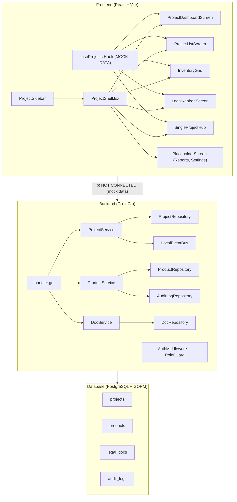
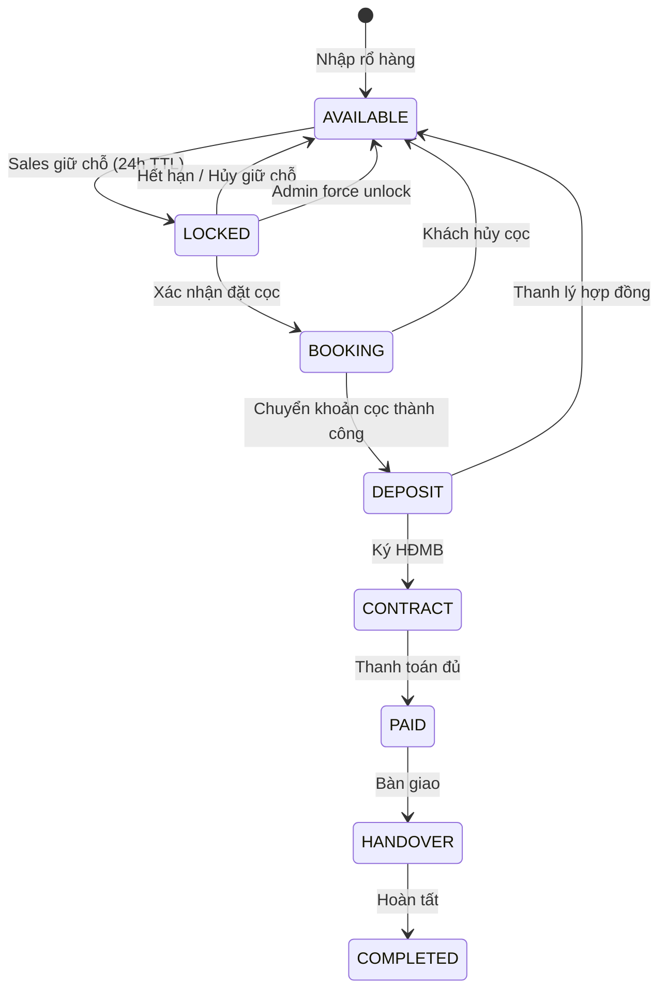
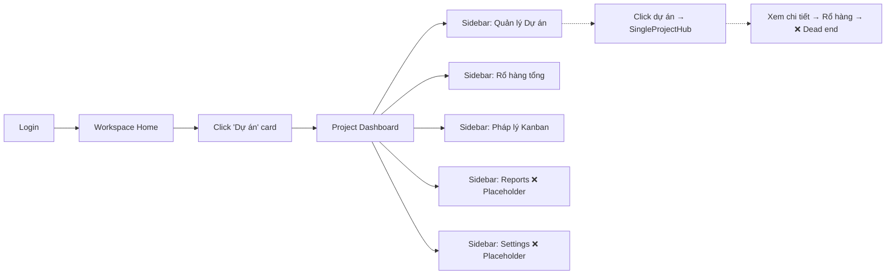
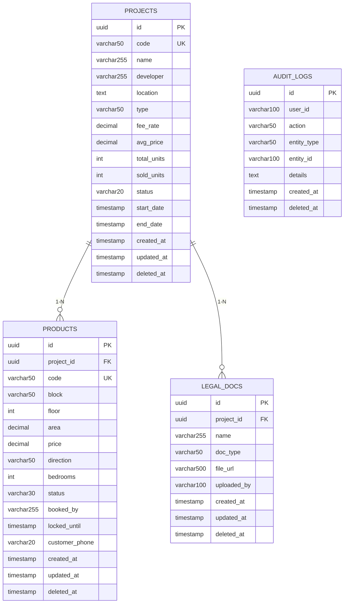

# 📊 Phân Tích & Đánh Giá Toàn Diện — Module Dự Án BĐS (Project Module)

**Ngày đánh giá:** 13/04/2026  
**Phiên bản:** SGROUP ERP Full — `main` branch  
**Phạm vi:** BA · UI · UX · Frontend · Backend · Database  

---

## 📋 Mục Lục

1. [Tổng quan hiện trạng](#1-tổng-quan-hiện-trạng)
2. [Đánh giá Business Analysis (BA)](#2-đánh-giá-business-analysis-ba)
3. [Đánh giá UI Design](#3-đánh-giá-ui-design)
4. [Đánh giá UX Flow](#4-đánh-giá-ux-flow)
5. [Đánh giá Frontend Architecture](#5-đánh-giá-frontend-architecture)
6. [Đánh giá Backend Architecture](#6-đánh-giá-backend-architecture)
7. [Đánh giá Database Design](#7-đánh-giá-database-design)
8. [Bảng tổng hợp Gap Analysis](#8-bảng-tổng-hợp-gap-analysis)
9. [Đề xuất Roadmap nâng cấp](#9-đề-xuất-roadmap-nâng-cấp)

---

## 1. Tổng Quan Hiện Trạng

### Kiến trúc Module



### Screenshots hiện tại

````carousel

<!-- slide -->

<!-- slide -->

````

### Recording quá trình review


---

## 2. Đánh Giá Business Analysis (BA)

### 2.1 Các nghiệp vụ đã có

| Nghiệp vụ | Mô tả | Trạng thái |
|:--|:--|:--|
| Quản lý Dự án | CRUD dự án với code, tên, CĐT, vị trí, loại BĐS | ✅ Có (Backend + Frontend mock) |
| Rổ hàng (Inventory) | Xem danh sách sản phẩm, filter theo dự án/trạng thái | ✅ Có (Frontend mock) |
| Quản lý trạng thái sản phẩm | Lock → Deposit → Sold workflow | ✅ Có (Backend only) |
| Pháp lý Kanban | Board 4 cột theo quy trình pháp lý | ✅ Có (Frontend mock) |
| Audit Log | Ghi nhận LOCK/UNLOCK/DEPOSIT/SOLD | ✅ Có (Backend only) |
| Event Bus | Publish event khi tạo dự án | ✅ Có (Local mock) |
| Auto-Unlock Cron Job | Tự mở khóa sản phẩm hết hạn | ✅ Có (Backend 1h cycle) |

### 2.2 Các nghiệp vụ THIẾU (Critical Gaps)

> [!CAUTION]
> Những nghiệp vụ sau là **bắt buộc** cho một hệ thống quản lý dự án BĐS chuyên nghiệp nhưng chưa được triển khai.

| Nghiệp vụ thiếu | Mức ưu tiên | Lý do cần thiết |
|:--|:--|:--|
| **Quản lý Booking/Đặt cọc** | 🔴 Critical | Quy trình giữ chỗ → cọc → ký HĐMB là core flow BĐS |
| **Quản lý Khách hàng (CRM link)** | 🔴 Critical | Mỗi giao dịch phải gắn với khách hàng, lịch sử tương tác |
| **Quản lý Hoa hồng/Commission** | 🔴 Critical | Tính hoa hồng cho sales, đại lý theo chính sách từng dự án |
| **Tiến độ thi công/Xây dựng** | 🟡 High | Theo dõi milestone xây dựng, bàn giao theo đợt |
| **Quản lý Hợp đồng (Contract)** | 🟡 High | HĐMB, phụ lục, lịch thanh toán, công nợ |
| **Báo cáo & Analytics** | 🟡 High | Doanh số theo dự án/tháng, tỷ lệ hấp thụ, funnel bán hàng |
| **Quản lý Chiết khấu/Khuyến mãi** | 🟠 Medium | Chính sách CK theo đợt bán, early bird, loyalty |
| **Bản đồ/Layout tương tác** | 🟠 Medium | Mặt bằng tầng/khu vực có thể click để xem sản phẩm |
| **Phân quyền theo Dự án** | 🟠 Medium | Mỗi PM chỉ thấy dự án mình quản lý |
| **Lịch sử giá/Pricing Engine** | 🟢 Low | Quản lý biến động giá theo thời gian, bảng giá chính thức |
| **Đồng bộ Multi-module** | 🟢 Low | Event-driven sync với Sales, HR, Accounting module |

### 2.3 Sơ đồ quy trình nghiệp vụ lý tưởng



> [!IMPORTANT]
> Hiện tại backend chỉ có 7 trạng thái (`AVAILABLE → LOCKED → BOOKED → PENDING_DEPOSIT → DEPOSIT → SOLD → COMPLETED`) nhưng **frontend chỉ nhận diện 4 trạng thái** (`AVAILABLE · RESERVED · SOLD · LOCKED`). Có sự **bất đồng bộ nghiêm trọng** giữa FE và BE.

---

## 3. Đánh Giá UI Design

### 3.1 Điểm mạnh

| Tiêu chí | Điểm | Nhận xét |
|:--|:--|:--|
| Design System | ⭐⭐⭐⭐ | Neo-Glassmorphism v2.2 nhất quán, palette cyan/blue/indigo phù hợp BĐS |
| Typography | ⭐⭐⭐⭐ | Font weight đa dạng (bold → black), tracking tốt |
| Color Coding | ⭐⭐⭐⭐⭐ | Status badges màu sắc rõ ràng, nhận diện nhanh |
| Animation | ⭐⭐⭐⭐ | Aurora background, hover effects, micro-interactions mượt |
| Dark/Light mode | ⭐⭐⭐⭐ | CSS variables chuyển đổi tốt |

### 3.2 Điểm yếu cần cải thiện

| Vấn đề | Mức nghiêm trọng | Chi tiết |
|:--|:--|:--|
| **Dashboard trống trải** | 🔴 Critical | Stats cards nhưng chỉ đếm từ 3 mock projects, không có chart/graph |
| **Không có Empty State** | 🟡 High | Khi không có dữ liệu, màn hình trống hoàn toàn |
| **Responsive mobile** | 🟡 High | Sidebar 280px cố định, không collapse trên tablet/mobile |
| **Accessibility (a11y)** | 🟡 High | Thiếu `aria-label`, contrast ratio thấp cho text muted trên glass |
| **Search bar fake** | 🟠 Medium | Header search Cmd+K không hoạt động, chỉ là placeholder |
| **Nút "Thêm Dự án mới" không hoạt động** | 🟡 High | Button không có onClick handler, thiếu modal form |
| **Placeholder screens** | 🟡 High | Reports & Settings đều là placeholder, tạo cảm giác chưa hoàn thiện |

### 3.3 Đề xuất nâng cấp UI

1. **Dashboard KPI Cards** — Thêm mini-chart (sparkline) cho từng stat card, tỷ lệ hấp thụ tổng, doanh thu ước tính
2. **Interactive Floor Plan** — Thay thế grid view bằng mặt bằng tầng tương tác cho căn hộ chung cư
3. **Data Visualization** — Biểu đồ tròn phân bổ trạng thái, biểu đồ cột doanh số theo tháng  
4. **Empty States** — Illustration + CTA cho mỗi trạng thái trống
5. **Sidebar Collapse** — Thu gọn sidebar thành icon-only mode trên màn hình nhỏ

---

## 4. Đánh Giá UX Flow

### 4.1 Luồng người dùng hiện tại



### 4.2 Vấn đề UX nghiêm trọng

> [!WARNING]
> Các vấn đề UX sau ảnh hưởng trực tiếp đến hiệu suất làm việc của người dùng.

| # | Vấn đề | Impact | Chi tiết |
|:--|:--|:--|:--|
| 1 | **Không có CRUD flow hoàn chỉnh** | 🔴 Blocking | Nút "Thêm dự án" / "Tạo hồ sơ" không hoạt động, không có form modal |
| 2 | **Không thể thao tác trên sản phẩm** | 🔴 Blocking | Inventory chỉ hiển thị, không thể lock/unlock/deposit/sold |
| 3 | **Legal Kanban không drag-and-drop** | 🟡 High | Không thể kéo thẻ giữa các cột như Trello/Jira |
| 4 | **Không có breadcrumb/navigation trail** | 🟠 Medium | Khi vào SingleProjectHub, không có đường quay lại rõ ràng |
| 5 | **Progress bar không real** | 🟠 Medium | `proj.progress` hardcode 35%, không tính từ dữ liệu thực |
| 6 | **Hardcode data trong SingleProjectHub** | 🟠 Medium | "120 Ha", "35%", "1/500" đều là static string |
| 7 | **Search không hoạt động ở Dashboard** | 🟠 Medium | Dashboard header search chỉ là UI giả |

### 4.3 Đề xuất cải thiện UX

1. **Full CRUD Modal Flow** — Form tạo/sửa dự án dạng multi-step wizard
2. **Inline Action Buttons trên Inventory** — Lock/Unlock/Deposit với confirmation dialog
3. **Drag-and-Drop Kanban** — Dùng `@dnd-kit/core` hoặc `react-beautiful-dnd`
4. **Breadcrumb Component** — Dashboard → Dự án → SGroup Riverside → Rổ hàng
5. **Global Command Palette** — Thực sự implement Cmd+K search
6. **Toast Notifications** — Khi thao tác thành công/thất bại
7. **Bulk Actions** — Chọn nhiều sản phẩm để lock/update cùng lúc

---

## 5. Đánh Giá Frontend Architecture

### 5.1 Cấu trúc hiện tại

```
features/project/
├── ProjectShell.tsx          # Layout wrapper + routing (149 LOC)
├── constants.ts              # Status/type configs (34 LOC)
├── types.ts                  # TypeScript interfaces (49 LOC)
├── components/
│   └── ProjectSidebar.tsx    # Sidebar navigation (82 LOC)
├── hooks/
│   └── useProjects.ts        # Mock data + hooks (150 LOC) ⚠️
└── screens/
    ├── ProjectDashboardScreen.tsx  (140 LOC)
    ├── ProjectListScreen.tsx       (151 LOC)
    ├── InventoryGrid.tsx           (148 LOC)
    ├── LegalKanbanScreen.tsx       (125 LOC)
    └── SingleProjectHub.tsx        (173 LOC)
```

### 5.2 Bảng đánh giá

| Tiêu chí | Điểm | Vấn đề |
|:--|:--|:--|
| Type Safety | ⭐⭐⭐ | Types có nhưng FE types khác BE models significantly |
| State Management | ⭐⭐ | Không dùng Zustand/Redux, chỉ có local useState |
| API Integration | ⭐ | **100% mock data**, frontend hoàn toàn chưa kết nối backend |
| Code Reuse | ⭐⭐ | Nhiều pattern lặp lại giữa các screen (search bar, filters) |
| Error Handling | ⭐ | Không có error boundary, loading fallback hạn chế |
| Testing | ⭐ | Không có test file nào |

### 5.3 Các vấn đề kỹ thuật nghiêm trọng

> [!CAUTION]
> **Frontend chưa kết nối API backend.** Toàn bộ dữ liệu đang dùng `MOCK_RE_PROJECTS`, `MOCK_RE_INVENTORY`, `MOCK_RE_LEGAL` hardcode trong `useProjects.ts`.

```diff
// useProjects.ts — Hiện tại
- const MOCK_RE_PROJECTS: REProject[] = [...]  // Hardcoded 3 projects
- useEffect(() => { setTimeout(() => { setData(MOCK_RE_PROJECTS) }, 400) }, [])

// Cần chuyển thành
+ const { data, isLoading, error } = useQuery(['projects'], () => projectApi.list())
```

**Type mismatch giữa FE và BE:**

| Field | Frontend Type | Backend Model | Mismatch |
|:--|:--|:--|:--|
| Status | `UPCOMING\|SELLING\|HANDOVER\|CLOSED` | `ACTIVE\|PAUSED\|CLOSED` | ❌ Completely different |
| Property Type | `LAND\|APARTMENT\|VILLA\|SHOPHOUSE` | `string (varchar 50)` | ⚠️ No enum on BE |
| Inventory Status | `AVAILABLE\|RESERVED\|SOLD\|LOCKED` | 7 states (AVAILABLE→COMPLETED) | ❌ FE missing states |
| LegalDoc | `status: RELegalProcedureStatus` | No status field on BE model | ❌ Missing entirely |

### 5.4 Đề xuất Frontend

1. **Tạo API layer** — `features/project/api/projectApi.ts` dùng Axios/fetch kết nối backend
2. **Dùng React Query** — `@tanstack/react-query` cho server state management
3. **Tạo Zustand store** — Quản lý UI state (selected project, filters, modal states)
4. **Đồng bộ Types** — Tự generate types từ OpenAPI/Swagger spec của backend
5. **Tách reusable components** — SearchBar, FilterSelect, StatCard, StatusBadge
6. **Thêm Error Boundary** — Bao bọc module routes
7. **Unit test với Vitest** — Test hooks và utils

---

## 6. Đánh Giá Backend Architecture

### 6.1 Cấu trúc hiện tại

```
modules/project/api/
├── cmd/main.go                          # Entry point, DI, GORM AutoMigrate
├── internal/
│   ├── handler/handler.go               # 17 endpoints (347 LOC)
│   ├── middleware/auth.go               # Mock JWT + RoleGuard (98 LOC)
│   ├── infrastructure/messaging/
│   │   └── event_bus.go                 # Local event bus (63 LOC)
│   ├── model/
│   │   ├── project.go                   # Project entity (48 LOC)
│   │   ├── product.go                   # Product entity (52 LOC)
│   │   ├── legal_doc.go                 # LegalDoc entity (30 LOC)
│   │   └── audit_log.go                 # AuditLog entity (29 LOC)
│   ├── repository/
│   │   ├── project_repo.go             # CRUD + sync units (77 LOC)
│   │   ├── product_repo.go             # CRUD + lock/unlock + cleanup (131 LOC)
│   │   ├── doc_repo.go                 # CRUD legal docs (? LOC)
│   │   └── audit_log_repo.go           # Create audit log (? LOC)
│   └── service/
│       ├── project_service.go           # Business logic (101 LOC)
│       ├── product_service.go           # Lock/Deposit/Sold flow (149 LOC)
│       └── doc_service.go              # Doc CRUD (? LOC)
```

### 6.2 Bảng đánh giá

| Tiêu chí | Điểm | Chi tiết |
|:--|:--|:--|
| Clean Architecture | ⭐⭐⭐⭐ | Repository pattern rõ ràng, separation of concerns tốt |
| DI (Dependency Injection) | ⭐⭐⭐ | Constructor injection, nhưng manual wiring |
| Auth/Security | ⭐⭐ | Mock token hardcode, chưa có JWT thật |
| Validation | ⭐⭐ | Chỉ dùng `ShouldBindJSON`, thiếu business rule validation |
| Error Handling | ⭐⭐ | Generic error wrapper, thiếu error codes chuẩn |
| Testing | ⭐ | Không có test file nào |
| Concurrency Safety | ⭐⭐⭐ | Atomic lock qua WHERE clause, nhưng thiếu distributed lock |
| API Documentation | ⭐ | Không có Swagger/OpenAPI |
| Logging | ⭐⭐ | Console log cơ bản, thiếu structured logging |

### 6.3 Vấn đề kỹ thuật

> [!WARNING]
> **Auth middleware hoàn toàn giả lập.** Hardcode 3 token → role mapping. Đây là lỗ hổng bảo mật nghiêm trọng nếu deploy production.

```go
// middleware/auth.go — MOCK (không dùng được production)
if token == "mock-admin-token" {
    role = "admin"
    userID = "U001"
}
```

**Bug trong `SoldProduct` handler:**

```go
// handler.go:284 — Bug: Tìm sản phẩm bằng productSvc.ListProjectProducts(ctx, id, ...)
// nhưng `id` ở đây là product ID, không phải project ID
// → Sẽ không tìm được projectID đúng để sync
if p, _, _ := h.productSvc.ListProjectProducts(c.Request.Context(), id, 1, 1); len(p) > 0 {
    product = &p[0]
}
```

**Race condition tiềm ẩn trong `SyncProjectUnits`:**

```go
// project_service.go:83-99 — Non-atomic read-then-write
total, _ := s.productRepo.CountByProjectID(ctx, id)  // Read
sold, _ := s.productRepo.CountSoldByProjectID(ctx, id)  // Read
s.projectRepo.UpdateTotalUnits(ctx, id, int(total))  // Write
s.projectRepo.UpdateSoldUnits(ctx, id, int(sold))    // Write
// Cần wrap trong transaction
```

### 6.4 Đề xuất Backend

1. **JWT Authentication thật** — Dùng `golang-jwt/jwt/v5`, refresh token
2. **Input Validation** — Dùng `go-playground/validator` cho request DTOs
3. **Swagger/OpenAPI** — Dùng `swaggo/swag` để auto-generate API docs
4. **Structured Logging** — Dùng `slog` hoặc `zap`
5. **Database Transaction** — Wrap `SyncProjectUnits` trong `db.Transaction`
6. **Unit Tests** — `handler_test.go`, `service_test.go` với mock repositories
7. **CORS proper** — Dùng `gin-contrib/cors` thay vì inline middleware
8. **Rate Limiting** — Cho endpoints như lock/deposit
9. **Health Check endpoint** — `/health` cho monitoring

---

## 7. Đánh Giá Database Design

### 7.1 Schema hiện tại (GORM AutoMigrate)



### 7.2 Bảng đánh giá

| Tiêu chí | Điểm | Chi tiết |
|:--|:--|:--|
| Normalization | ⭐⭐⭐ | Cơ bản 3NF, nhưng `booked_by` nên là FK |
| Indexing | ⭐⭐ | Chỉ có index trên PK, UK, `deleted_at` |
| Constraints | ⭐⭐ | Thiếu CHECK constraints cho status, price > 0 |
| Audit Trail | ⭐⭐⭐ | Có audit_logs nhưng chưa comprehensive |
| Soft Delete | ⭐⭐⭐⭐ | GORM `DeletedAt` pattern đúng |
| UUID v7 | ⭐⭐⭐⭐⭐ | Sortable, time-ordered — rất tốt |
| Migration | ⭐⭐ | Dùng AutoMigrate, không có versioned migration |

### 7.3 Thiếu sót Database

> [!IMPORTANT]
> `GORM AutoMigrate` không nên dùng trong production vì không thể rollback, không track schema changes.

**Missing tables cho nghiệp vụ hoàn chỉnh:**

| Bảng cần thêm | Mối quan hệ | Mục đích |
|:--|:--|:--|
| `bookings` | Product 1-N | Quản lý đặt cọc, giữ chỗ |
| `contracts` | Booking 1-1 | HĐMB, phụ lục |
| `payment_schedules` | Contract 1-N | Lịch thanh toán đợt |
| `payments` | PaymentSchedule 1-N | Giao dịch thanh toán thực |
| `commissions` | Product/Booking 1-1 | Hoa hồng cho sales/agency |
| `project_members` | Project N-M User | Phân quyền theo dự án |
| `price_lists` | Project 1-N | Bảng giá chính thức theo đợt |
| `construction_phases` | Project 1-N | Tiến độ xây dựng |
| `legal_doc_statuses` | LegalDoc 1-N | Lịch sử trạng thái pháp lý |

### 7.4 Missing Indexes

```sql
-- Cần thêm composite indexes cho các query phổ biến
CREATE INDEX idx_products_project_status ON products(project_id, status);
CREATE INDEX idx_products_locked_until ON products(status, locked_until) WHERE status = 'LOCKED';
CREATE INDEX idx_audit_logs_entity ON audit_logs(entity_type, entity_id, created_at);
CREATE INDEX idx_legal_docs_project ON legal_docs(project_id, doc_type);
```

---

## 8. Bảng Tổng Hợp Gap Analysis

| Dimension | Current Score | Target Score | Gap | Priority |
|:--|:--|:--|:--|:--|
| **Business Logic** | 3/10 | 9/10 | ▓▓▓▓▓▓░░░░ 60% | 🔴 Critical |
| **UI Design** | 7/10 | 9/10 | ▓▓░░░░░░░░ 20% | 🟡 High |
| **UX Flow** | 3/10 | 8/10 | ▓▓▓▓▓░░░░░ 50% | 🔴 Critical |
| **Frontend Code** | 4/10 | 9/10 | ▓▓▓▓▓░░░░░ 50% | 🔴 Critical |
| **Backend Code** | 6/10 | 9/10 | ▓▓▓░░░░░░░ 30% | 🟡 High |
| **Database** | 5/10 | 9/10 | ▓▓▓▓░░░░░░ 40% | 🟡 High |

---

## 9. Đề Xuất Roadmap Nâng Cấp

### Phase 1 — Foundation Fix (1-2 tuần) 🔴

> Ưu tiên: Kết nối FE-BE, sửa bugs, hoàn thiện CRUD cơ bản

- [ ] **Đồng bộ Types FE ↔ BE** — Thống nhất status enums, types
- [ ] **Kết nối Frontend → Backend API** — Thay mock bằng real API calls
- [ ] **Implement JWT Authentication** — Token thật, refresh token
- [ ] **CRUD forms** — Modal tạo/sửa dự án, thêm sản phẩm
- [ ] **Fix SoldProduct bug** — Sửa handler.go:284
- [ ] **Database Migration** — Chuyển từ AutoMigrate sang versioned migration (golang-migrate)
- [ ] **Add missing indexes** — Composite indexes cho queries chính

---

### Phase 2 — Business Features (2-3 tuần) 🟡

> Ưu tiên: Hoàn thiện nghiệp vụ core BĐS

- [ ] **Booking/Deposit Flow UI** — Lock → Confirm → Deposit buttons trên Inventory
- [ ] **Legal Kanban Drag & Drop** — Kéo thả thẻ giữa các cột
- [ ] **Dashboard Charts** — Biểu đồ doanh số, tỷ lệ hấp thụ (Recharts/Victory)
- [ ] **Booking Management** — Table bookings + payment tracking CƠ BẢN
- [ ] **Commission Engine** — Tính hoa hồng theo policy từng dự án
- [ ] **Reports Screen** — Thay placeholder bằng real analytics
- [ ] **Settings Screen** — Cấu hình project-level settings
- [ ] **Toast Notifications** — Feedback cho mọi thao tác
- [ ] **Swagger API Docs** — Auto-generate từ handler annotations

---

### Phase 3 — Premium Features (3-4 tuần) 🟢

> Ưu tiên: Nâng tầm chuyên nghiệp, UX nâng cao

- [ ] **Interactive Floor Plan** — Mặt bằng tầng click-to-select
- [ ] **Contract Management** — HĐMB, phụ lục, e-sign integration
- [ ] **CRM Integration** — Link khách hàng từ CRM module
- [ ] **Construction Progress** — Timeline/Gantt cho tiến độ xây dựng
- [ ] **Global Command Palette** — Cmd+K search thật
- [ ] **Real-time Notifications** — WebSocket cho lock/unlock events
- [ ] **Export Reports** — PDF/Excel export
- [ ] **Mobile Responsive** — Sidebar collapse, touch-friendly Kanban
- [ ] **Unit & Integration Tests** — Coverage > 70%
- [ ] **RabbitMQ Integration** — Thay LocalEventBus bằng real broker

---

> [!TIP]
> **Khuyến nghị bắt đầu từ Phase 1** — Việc kết nối Frontend ↔ Backend là quan trọng nhất, vì hiện tại 2 bên hoàn toàn độc lập. Một khi đã kết nối, các feature sau sẽ triển khai nhanh hơn đáng kể.
